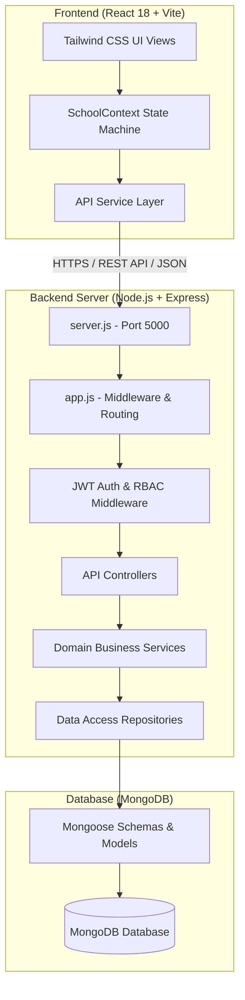

# SchoolERP — Comprehensive School Management System

> Production-ready Full-Stack MERN (MongoDB, Express.js, React 18, Node.js) School ERP Architecture engineered for small to mid-sized educational institutions, academies, and training centers.

---

## 1. Project Overview

**SchoolERP** is an administrative management suite that automates the everyday operational workflow of schools. It simplifies student admissions, parent records, classroom allocations, daily student attendance, fee collections, payment receipts, and institutional reporting.

### Core Modules
* **Student Information System (SIS)**: Complete pupil profiles, admission tracking, roll numbers, and academic history.
* **Parent & Guardian Directory**: Linked parent contacts, emergency details, and direct communication logs.
* **Class & Section Management**: Classroom capacities, section divisions, and class teacher allocations.
* **Attendance Register**: Rapid roll-call marking with instant status summaries (Present, Absent, Late, Excused).
* **Fee Collection & Billing**: Multi-mode payment processing (Cash, Bank Transfer, Cheque, UPI), invoice balance tracking, and printable receipts.
* **Analytics & Reports**: Visual KPI dashboards, attendance ratios, revenue metrics, and fee recovery ledgers.

---

## 2. MERN Architecture Diagram



---

## 3. Folder Structure

```
SchoolERP/
│
├── frontend/                       # Client Application (React 18 + Vite)
│   ├── src/
│   │   ├── assets/                 # Component graphics & icons
│   │   ├── components/             # React feature & UI components
│   │   │   ├── attendance/         # Roll-call & attendance history
│   │   │   ├── auth/               # Login screen
│   │   │   ├── classes/            # Class & section views
│   │   │   ├── common/             # Modals, toasts, buttons, receipt modals
│   │   │   ├── dashboard/          # Metric cards & statistics
│   │   │   ├── fees/               # Fee records & collection modals
│   │   │   ├── layout/             # Sidebar, Header, and layout shell
│   │   │   ├── parents/            # Guardian directory
│   │   │   ├── reports/            # Exportable summaries
│   │   │   ├── settings/           # ERP settings & configuration
│   │   │   └── students/           # Student admission & details modals
│   │   ├── context/                # React Context (SchoolContext.tsx)
│   │   ├── data/                   # Initial fixtures & demo seed data
│   │   ├── hooks/                  # Custom React hooks
│   │   ├── layouts/                # View layouts
│   │   ├── pages/                  # Routed views
│   │   ├── routes/                 # Navigation definitions
│   │   ├── services/               # API clients & backend connectors
│   │   ├── types/                  # TypeScript interface definitions
│   │   ├── utils/                  # Formatting & pure functions
│   │   ├── App.jsx / App.tsx       # Root layout component
│   │   ├── index.css               # Tailwind CSS stylesheet
│   │   └── main.jsx / main.tsx     # DOM mounting entry point
│   ├── public/                     # Static files & assets
│   ├── assets/                     # Brand assets
│   ├── components/                 # Root component re-export alias
│   ├── pages/                      # Root page alias
│   ├── layouts/                    # Root layout alias
│   ├── context/                    # Root context alias
│   ├── hooks/                      # Root hooks alias
│   ├── services/                   # Root services alias
│   ├── utils/                      # Root utils alias
│   ├── routes/                     # Root routes alias
│   ├── App.jsx                     # Root App entry proxy
│   ├── main.jsx                    # Root main entry proxy
│   ├── package.json                # Frontend dependencies
│   ├── vite.config.js / .ts        # Vite configuration
│   ├── tsconfig.json               # TypeScript configuration
│   ├── .env.example                # Frontend environment template
│   ├── .gitignore                  # Frontend ignore rules
│   └── README.md                   # Frontend documentation
│
├── backend/                        # API Application (Node.js + Express)
│   ├── src/
│   │   ├── config/                 # DB & environment configuration
│   │   ├── constants/              # System roles & HTTP status codes
│   │   ├── controllers/            # Request handlers
│   │   ├── docs/                   # API documentation & specs
│   │   ├── middleware/             # JWT auth & error interceptors
│   │   ├── models/                 # Mongoose data schemas
│   │   ├── repositories/           # Database abstraction queries
│   │   ├── routes/                 # Express route definitions
│   │   ├── services/               # Business logic & calculation layer
│   │   ├── utils/                  # Response formatters & helpers
│   │   ├── validators/             # Request payload schema validators
│   │   └── app.js                  # Express application setup
│   ├── server.js                   # Node HTTP server entry point
│   ├── package.json                # Backend dependencies
│   ├── .env.example                # Backend environment template
│   ├── .gitignore                  # Backend ignore rules
│   └── README.md                   # Backend documentation
│
├── docs/                           # Architecture & Engineering Documentation
│   ├── api/                        # API endpoint specifications
│   ├── architecture/               # System architecture & designs
│   ├── database/                   # Schema design & data models
│   └── deployment/                 # Cloud hosting & deployment guides
│
├── phases.md                       # 8-Phase Development Roadmap
├── memory.md                       # Architectural context memory bank
├── rules.md                        # Coding standards & architectural invariants
├── decision.md                     # Architecture Decision Records (ADRs)
├── log.md                          # Chronological migration & change log
├── README.md                       # Root repository documentation
└── .gitignore                      # Root git ignore rules
```

---

## 4. Tech Stack

| Domain | Technology | Description |
| :--- | :--- | :--- |
| **Frontend Framework** | React 18 | Declarative component UI library |
| **Frontend Language** | TypeScript / JavaScript | Type-safe enterprise JavaScript |
| **Build Tool** | Vite 6 | High-speed ESM development bundler |
| **Styling** | Tailwind CSS 4 | Utility-first responsive design system |
| **Icons** | Lucide React | Modern, consistent icon library |
| **Backend Runtime** | Node.js (ES Modules) | High-throughput JavaScript runtime |
| **Backend Framework** | Express.js 4 | Minimalist web application framework |
| **Database** | MongoDB | Document database for unstructured & structured records |
| **ODM** | Mongoose 8 | Schema-based data modeling for MongoDB |
| **Authentication** | JWT (`jsonwebtoken`) | Stateless token-based user authentication |
| **Security** | `bcryptjs`, CORS | Password hashing and cross-origin resource policy |

---

## 5. Installation & Setup

### Prerequisites
* **Node.js**: v18.0.0 or higher
* **npm**: v9.0.0 or higher
* **MongoDB**: Local MongoDB instance or free MongoDB Atlas cluster

### 1. Clone the Repository
```bash
git clone https://github.com/your-username/schoolerp.git
cd schoolerp
```

---

## 6. Running the Frontend

```bash
# 1. Navigate to the frontend directory
cd frontend

# 2. Install dependencies
npm install

# 3. Create environment configuration
cp .env.example .env

# 4. Start the development server
npm run dev
```

The application will be live at: **`http://localhost:5173`** (or `http://localhost:3000`).

---

## 7. Running the Backend

```bash
# 1. Open a new terminal and navigate to backend directory
cd backend

# 2. Install dependencies
npm install

# 3. Create environment configuration
cp .env.example .env

# 4. Configure MONGODB_URI and JWT_SECRET inside backend/.env

# 5. Start the server
npm run dev    # For development with nodemon
# OR
npm start      # For standard node execution
```

The API will listen at: **`http://localhost:5000`**
Health check endpoint: **`http://localhost:5000/api/health`**

---

## 8. Deployment Overview

* **Frontend**: Deploy static assets from `frontend/dist` to modern CDNs such as **Vercel**, **Netlify**, or **AWS S3 + CloudFront**. Set `VITE_API_URL` to your production API URL.
* **Backend**: Deploy `backend/` to containerized or PaaS services such as **Render**, **Railway**, **DigitalOcean App Platform**, or **AWS ECS/EC2**.
* **Database**: Managed **MongoDB Atlas** database cluster.

For complete cloud configuration steps, consult [docs/deployment/deployment-guide.md](docs/deployment/deployment-guide.md).

---

## 9. Contributors

* **Lead Architect & Engineer**: Antigravity AI & Senior Engineering Team
* **Project Maintainers**: SchoolERP Engineering Community
"# Schoolerp-management" 
